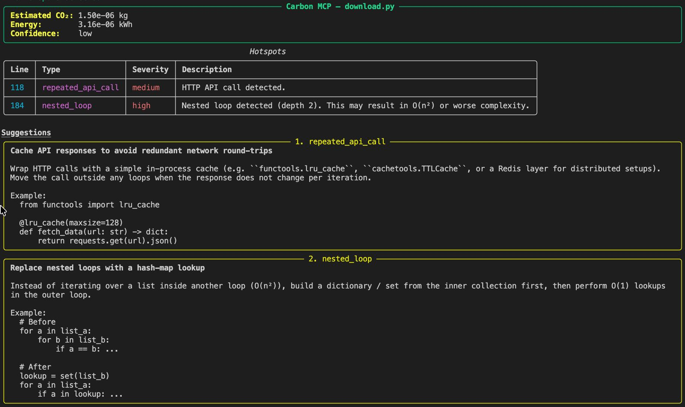
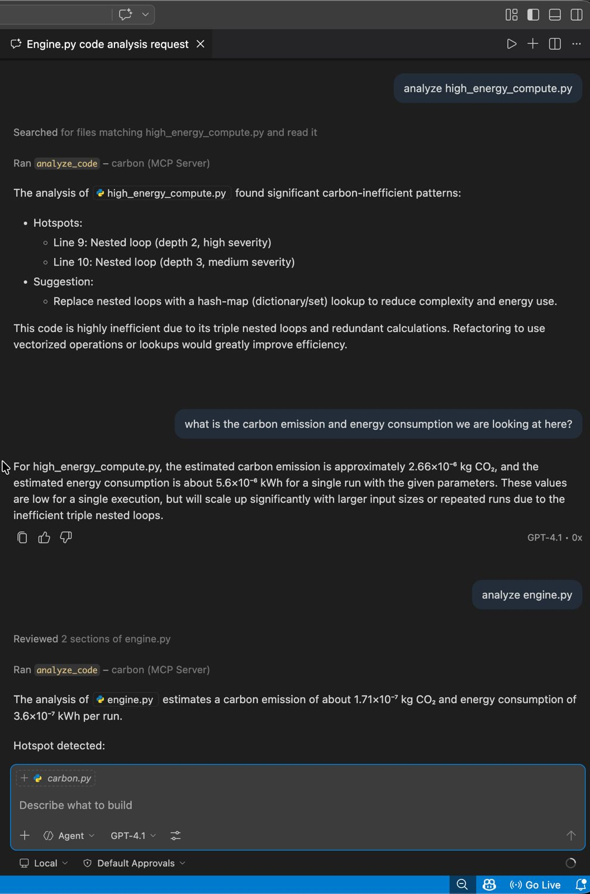

# Carbon MCP: Heuristic Code Carbon Analyzer

 

> Analyze source code for carbon-inefficient patterns, estimate CO₂ emissions, and return actionable optimization suggestions.

## What it does

Carbon MCP currently focuses on Python source. It detects a small set of heuristic hotspots, estimates their energy use and CO₂ impact, and returns suggestions that explain what to change and why.

The estimates are intentionally heuristic. They are designed for directional guidance, trend comparison, and quick developer decision-making — not audited carbon accounting. Key assumptions and standards used by Carbon MCP:

- **Grid intensity baseline & energy heuristics:**

| Parameter            | Value              | Source/file            | Notes                                 |
| -------------------- | ------------------ | ---------------------- | ------------------------------------- |
| Grid intensity       | 0.475 kg CO₂ / kWh | `estimators/carbon.py` | IEA 2022 world average (overrideable) |
| `nested_loop`        | 2.8 × 10⁻⁶ kWh     | `estimators/energy.py` | 100×100 iterations, 100W server       |
| `repeated_api_call`  | 3.6 × 10⁻⁷ kWh     | `estimators/energy.py` | \~1 KB HTTPS round-trip               |
| (other/unknown type) | 1.0 × 10⁻⁷ kWh     | `estimators/energy.py` | Fallback for unclassified hotspots    |

These values are coarse, linear proxies used to rank and compare hotspots. For region-specific grid intensity, override `CARBON_INTENSITY_KG_PER_KWH` in your deployment.

- **Confidence level:** Emissions returned by the pipeline currently carry a conservative `low` confidence flag because the underlying hotspot counts and scaling assumptions are heuristic.
- **Intended use:** Use the output to identify relative hotspots, prioritize optimizations, and track trends across versions or deployments. The tool is useful in development and code-review workflows and as an MCP service for editor/agent integrations.

In short: results are actionable for developers and teams as directional guidance, but they are not a substitute for measured or audited carbon accounting.

The current analysis pipeline is:

User code -\> Python AST analyzer -\> hotspots -\> energy estimate -\> carbon estimate -\> suggestions -\> structured response

## Project layout

```
carbon-mcp/
├── analyzer/        # Analyzer abstractions and Python AST implementation
├── cli/             # Typer CLI entry point
├── core/            # Analysis engine and suggestion orchestration
├── estimators/      # Energy and carbon estimation heuristics
├── rules/           # Pattern detectors used by the Python analyzer
├── server/          # FastAPI app, MCP stdio server, and response schemas
└── tests/           # Analyzer tests
```

## Install

```bash
python -m venv .venv
source .venv/bin/activate
pip install -r requirements.txt
```

## Run

## VS Code MCP setup

This repository already includes a VS Code MCP configuration. If you need to set it up manually, point the server at `server.mcp_server` with the Python interpreter from your virtual environment.

```json
{
  "servers": {
    "carbon": {
      "type": "stdio",
      "command": "${workspaceFolder}/.venv/bin/python",
      "args": ["-m", "server.mcp_server"]
    }
  }
}
```

## CLI

Analyze a file:

```bash
carbon analyze path/to/script.py
```

Start the HTTP API:

```bash
carbon serve
```

Start the MCP stdio server for VS Code or other MCP clients:

```bash
carbon serve-mcp
```

## API

The FastAPI app listens on `http://127.0.0.1:8000` by default.

Health check:

```bash
curl http://127.0.0.1:8000/health
```

Analyze code:

```bash
curl -X POST http://127.0.0.1:8000/analyze_code \
  -H "Content-Type: application/json" \
  -d '{"code":"for i in range(100):\n    for j in range(100):\n        pass"}'
```

The response includes `emissions`, `hotspots`, and `suggestions`.

## Testing

```bash
pytest -v
```

## Extending the analyzer

To add a new detector, create a rule in `rules/`, register it in `analyzer/python_analyzer.py`, and add a suggestion in `core/engine.py` if the new hotspot should have guidance.
